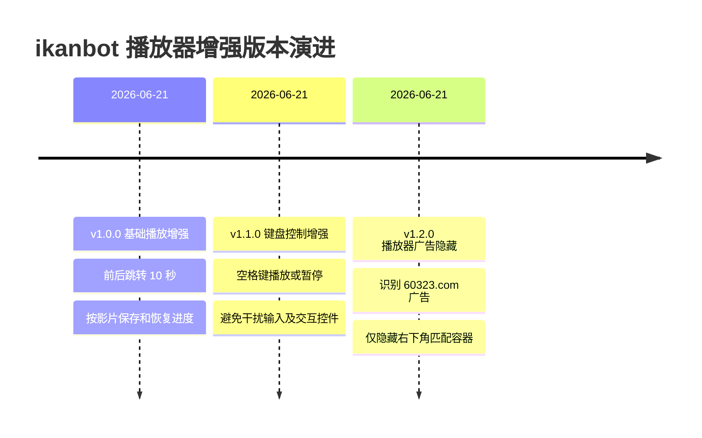

# ikanbot 播放器增强：版本更迭

> [!summary] 当前版本
> **v1.2.0** · 在基础播放增强和进度记忆之上，已支持空格键播放/暂停，并可自动隐藏播放器右下角包含 `60323.com` 的 DOM 广告覆盖层。

项目地址：[gem000908/ikan-pro](https://github.com/gem000908/ikan-pro) · [当前脚本源码](https://github.com/gem000908/ikan-pro/blob/main/ikanbot-player-enhancer.user.js)

## 版本时间线

## 版本总览

| 版本 | 日期 | 定位 | 核心变化 |
| --- | --- | --- | --- |
| `1.0.0` | 2026-06-21 | 首个可用版本 | ±10 秒跳转、方向键控制、按影片保存及恢复进度 |
| `1.1.0` | 2026-06-21 | 键盘体验增强 | 普通页面区域可用空格键播放/暂停，并规避输入和交互控件 |
| `1.2.0` | 2026-06-21 | 播放器界面净化 | 自动识别并隐藏播放器右下角包含 `60323.com` 的 DOM 广告覆盖层 |

## v1.2.0

**主题：播放器广告隐藏**

### 新增

- 识别文本中包含 `60323.com` 的已知广告，即使存在空格或大小写差异也能匹配。
- 将检测范围限制在播放器右下区域，并限制候选元素尺寸，降低误隐藏风险。
- 从命中的子元素向外选择合适的广告容器，避免只隐藏文字而残留背景。
- 首次加载及播放器 DOM 动态重建时都会重新扫描。
- 重复扫描保持幂等，不会反复处理已隐藏元素。

### 边界

- 只处理网页 DOM 广告覆盖层。
- 不裁剪或遮挡视频画面。
- 无法处理已经烧录进视频帧的水印。

### 相关记录

- [[superpowers/specs/2026-06-21-player-ad-hiding-design|播放器广告隐藏设计]]
- [[superpowers/plans/2026-06-21-player-ad-hiding|播放器广告隐藏实施计划]]
- GitHub：[设计文档](https://github.com/gem000908/ikan-pro/blob/main/docs/superpowers/specs/2026-06-21-player-ad-hiding-design.md) · [实施计划](https://github.com/gem000908/ikan-pro/blob/main/docs/superpowers/plans/2026-06-21-player-ad-hiding.md)
- 主要提交：[2fe2763](https://github.com/gem000908/ikan-pro/commit/2fe2763) · [feca3ad](https://github.com/gem000908/ikan-pro/commit/feca3ad) · [9156be0](https://github.com/gem000908/ikan-pro/commit/9156be0) · [44477f2](https://github.com/gem000908/ikan-pro/commit/44477f2)

## v1.1.0

**主题：空格键播放/暂停**

### 新增

- 在普通页面区域按空格键切换视频的播放和暂停状态。
- 同时兼容 `event.code === "Space"`、空格字符及旧式 `Spacebar` 键值。
- 对 `video.play()` 返回的 Promise 做拒绝处理，避免未捕获异常。

### 交互保护

- 输入框、文本域、选择框和可编辑区域聚焦时不接管空格键。
- 按钮、链接及 `role="button"` 元素聚焦时保留浏览器原生行为。
- `Alt`、`Ctrl`、`Meta` 等组合键不触发播放切换。

### 相关记录

- [[superpowers/specs/2026-06-21-space-playback-toggle-design|空格播放切换设计]]
- [[superpowers/plans/2026-06-21-space-playback-toggle|空格播放切换实施计划]]
- GitHub：[设计文档](https://github.com/gem000908/ikan-pro/blob/main/docs/superpowers/specs/2026-06-21-space-playback-toggle-design.md) · [实施计划](https://github.com/gem000908/ikan-pro/blob/main/docs/superpowers/plans/2026-06-21-space-playback-toggle.md)
- 主要提交：[35d3cc7](https://github.com/gem000908/ikan-pro/commit/35d3cc7)

## v1.0.0

**主题：基础播放增强与进度记忆**

### 首发功能

- 在播放控件后增加 `−10` 和 `+10` 按钮。
- 使用 `←` / `→` 方向键后退或前进 10 秒。
- 输入框、文本域、选择框或可编辑区域聚焦时不响应方向键。
- 为每部影片独立保存观看进度，约每 5 秒更新一次。
- 暂停、页面隐藏或离开页面时补充保存进度。
- 再次进入同一影片时自动恢复进度。
- 小于 5 秒的记录不恢复；距离片尾不足 30 秒或播放结束后清除记录。
- 支持播放器延迟出现及切换线路后的 DOM 重建，且不会重复创建按钮。

### 数据与隐私

- 进度仅保存在当前网站来源的浏览器 `localStorage` 中。
- 脚本不抓取影片或线路，不读取、解析或导出媒体地址，也不发送网络请求。

### 相关记录

- [[superpowers/specs/2026-06-21-ikanbot-player-enhancement-design|播放器增强设计]]
- [[superpowers/plans/2026-06-21-ikanbot-player-enhancement|播放器增强实施计划]]
- GitHub：[设计文档](https://github.com/gem000908/ikan-pro/blob/main/docs/superpowers/specs/2026-06-21-ikanbot-player-enhancement-design.md) · [实施计划](https://github.com/gem000908/ikan-pro/blob/main/docs/superpowers/plans/2026-06-21-ikanbot-player-enhancement.md)
- 主要提交：[e2c9d2d](https://github.com/gem000908/ikan-pro/commit/e2c9d2d)

## 演进脉络

1. **v1.0.0：补齐播放基础能力** — 解决跳转操作和跨会话观看进度问题。
2. **v1.1.0：降低操作成本** — 将常用的播放/暂停动作扩展到键盘，同时保护原生交互。
3. **v1.2.0：减少视觉干扰** — 在不触碰视频画面的前提下，隐藏明确识别的播放器广告覆盖层。

## 维护说明

版本号以 `ikanbot-player-enhancer.user.js` 文件头部的 `@version` 为准。新增版本时，建议同步更新本页的 `updated`、`current_version`、版本总览与时间线。
